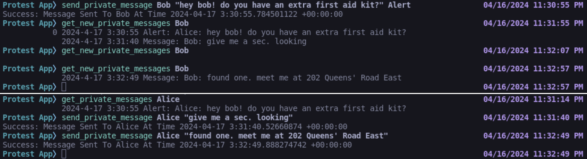
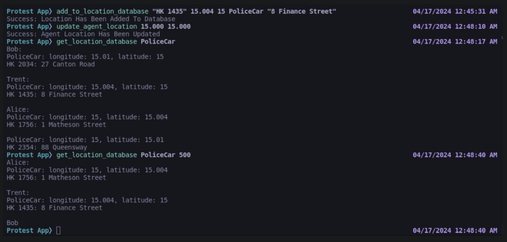
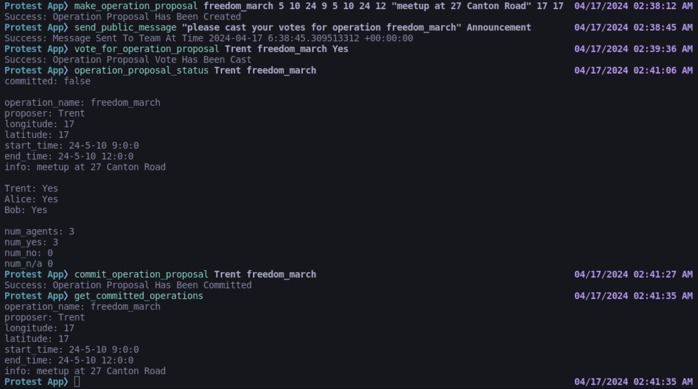

# ProtestApp: Private Protest Coordination

**ProtestApp** is an app for privately coordinating protests built on top of the Princeton SNS SCUBA framework. Via SCUBA, application traffic is double ratchet encrypted and application state is stored on the client machines, not the central server. Although application state is decentralized, ProtestApp provides linearizability guarantees. The core functionalities of the app are private & public messaging, location information database writing & querying, and operation proposal & voting.

Note that **senior-thesis** is an independent copy of the original [**princeton-sns/scuba**](https://github.com/princeton-sns/scuba) repository. Therefore, credit for any of the work that that is outside of the **senior-thesis**/apps/cmdline/senior-thesis subdirectory belongs to the developers of the original repository. In other words, all of the code that is specific to **senior-thesis** can be found within the **senior-thesis**/apps/cmdline/senior-thesis subdirectory.

## Installing and Running from Source

Rust and Cargo must be installed on your machine. Visit https://rustup.rs for installation instructions.

Open a terminal window and ``cd`` to ``senior-thesis/apps/cmdline/senior-thesis``. Run ``./startshards.sh & ./startsequencer.sh``. This terminal window represents your central **server** for ProtestApp.

Open another terminal window ``cd`` to ``senior-thesis/apps/cmdline/senior-thesis``. This terminal window represents a **client** instance of ProtestApp. Run ``cargo run`` to spin up this instance. You will need to repeat these steps if you want to create multiple ProtestApp clients. It is quite likely that you'll encounter an issue with CMake. If this happens, download the latest version of CMake (e.g. via ``brew install cmake`` on MacOS) and run ``export CMAKE_POLICY_VERSION_MINIMUM=3.5`` before attempting the ``cargo run`` command again.

Detailed instructions on how to use the application can be found in the senior-thesis/written_final_report.pdf writeup; read Chapter 5 and Section 4.1.2. Do note that **ProtestApp** currently only works when the clients & server are all instances that live on the same machine (i.e. when no network calls are involved).

## Application Sneak Peak

### Private Messaging

### Location Database

### Operation Voting

